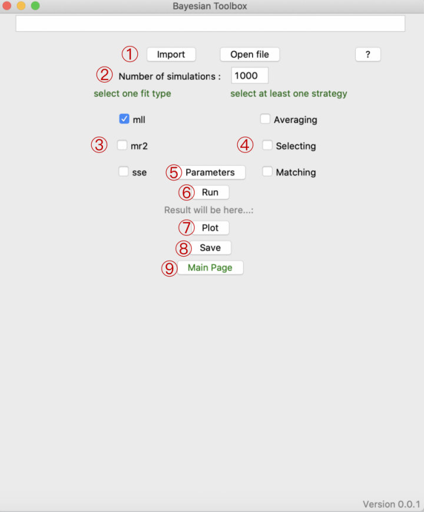

Graphical User Interface (GUI)
=============

.. tabs::

   .. tab:: Import and call
      :ref:`I_C`

   .. tab:: Fitting module
      :ref:`F_M`

.. _I_C:

Import and call

.. code-block:: bash

      import bcitoolbox as btb

.. code-block:: bash

      btb.gui()

.. _F_M:

**Fitting module**

1. Import / Open file

Users can upload single or multiple files simultaneously via either *Import* or *Open file*. Users can also add the file paths to the entry box and click *Import* to upload.

