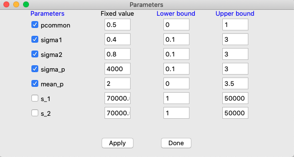
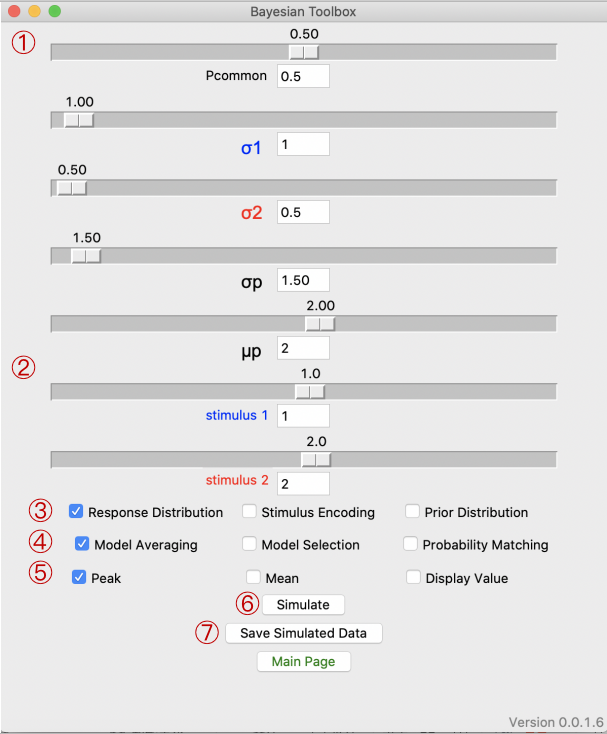

Graphical User Interface (GUI)
=============

**Table of Contents:**

- :ref:`Import and Call`
- :ref:`Model Fitting`
- :ref:`Sensory Simulation`

Import and Call
===============

.. code-block:: bash

      import bcitoolbox as btb

.. code-block:: bash

      btb.gui()

Model Fitting
=============

.. image:: image.gif

1. Import / Open file

Users can upload single or multiple files simultaneously via either *Import* or *Open file*. Users can also add the file paths to the entry box and click *Import* to upload.

The selected files containing behavioral data must be .csv files and need to be in the following format:

+-----------------------+-----------------------+---------------------------+---------------------------+ 
|True sti from modalityU|True sti from modalityD|Reported sti from modalityU|Reported sti from modalityD| 
+-----------------------+-----------------------+---------------------------+---------------------------+
|             ...       |...                    | ...                       | ...                       |
+-----------------------+-----------------------+---------------------------+---------------------------+

2. Number of simulations

Number of samples for the probability distribution for each case. Users can choose 1000 for testing and 10000 for final publication.

3. Fit type

The BCI toolbox provides three fit types, which is also how errors are 
calculated:

*mll*: Minus log likelihood

*mr2*: Minus R square

*sse*: Sum of Squares for Errors

Users can select any one of it depending on specific condition.

4. Decision Strategy

The BCI toolbox provides three different decision strategies:

*Model Averaging*:Model averaging is when the observer weights the estimates of the stimulus locations by the inferred probabilities of their causal structure. Considered the most optimal strategy. See equation 15 in Wozny and Shams (2011).

*Model Selection*: Model selection is when the observer selects the most likely causal structure and estimates the stimulus location wholly on the basis of the selected model. See equation 16 in Wozny and Shams (2011).

*Probability Matching*: Probability matching is a strategy that choses the estimates from either causal structure based on their inferred probabilities. Although this method is suboptimal, it appears to be the most frequently used in cognitive tasks. See equation 17 in Wozny and Shams (2011).

Users need to select at least one strategy for fitting. If selected strategies are more than one, the toolbox will automatically compare the results of each fit and output the optimal result.

5. Parameters 

Users can set the target estimated parameters and set their ranges.

*pcommon*: The prior probability that both sensory information can be attributed to one cause.

*sigmaU*: The standard deviation of the Gaussian distribution of the likelihood for modality Up.

*sigmaD*: The standard deviation of the Gaussian distribution of the likelihood for modality Down.

*sigmap*: The standard deviation of the Gaussian distribution of the prior.

*mup*: The mean of the Gaussian distribution of the prior.

*sU*: A constant added to the mean of the Gaussian distribution for the likelihood for modality Up.

*sD*: A constant added to the mean of the Gaussian distribution for the likelihood for modality Down.

6. Run

Users can click run after the above steps and wait for the final results. The running status will be always updated on the page.

After the fitting is complete, the results of it will be presented in a new window. The user can browse the fitting results and click save to save the results as a .txt file.

7. Plot

Users can click plot to get the fitting result they want for a particular piece of data.

8. Figure Save

Users can click save to save all fitting figures to folder. 

9. Main Page

Go back to main page.

Sensory Simulation
==================

This is the content related to sensory simulation.

1. Parameters

*pcommon*: The prior probability that both sensory information can be attributed to one cause.

*sigmaU*: The standard deviation of the Gaussian distribution of the likelihood for modality Up.

*sigmaD*: The standard deviation of the Gaussian distribution of the likelihood for modality Down.

*sigmap*: The standard deviation of the Gaussian distribution of the prior.

*mup*: The mean of the Gaussian distribution of the prior.

2. Stimuli

Users can set the true stimuli.

3. Elements

*Response Distribution*: Display the outputs of response distribution based on the prior and likelihood.

*Stimulus Encoding*: Display the likelihoods of stimulus encoding.

*Prior Distribution*: Display the distribution of prior expectation on the stimuli.

4. Strategies

*Model Averaging*:Model averaging is when the observer weights the estimates of the stimulus locations by the inferred probabilities of their causal structure. Considered the most optimal strategy. See equation 15 in Wozny and Shams (2011).

*Model Selection*: Model selection is when the observer selects the most likely causal structure and estimates the stimulus location wholly on the basis of the selected model. See equation 16 in Wozny and Shams (2011).

*Probability Matching*: Probability matching is a strategy that choses the estimates from either causal structure based on their inferred probabilities. Although this method is suboptimal, it appears to be the most frequently used in cognitive tasks. See equation 17 in Wozny and Shams (2011).

5. Estimates

*Peak*: Value indicated by red and blue diamonds.

*Mean*: Value indicated by red and blue circles.

*Display Value*:Display the value of the model estimate of probability on the figure.

6. Simulate

Click the button to generate the simulated results.

7. Save the simulated data

Click the button to save the simulated numerical data.

