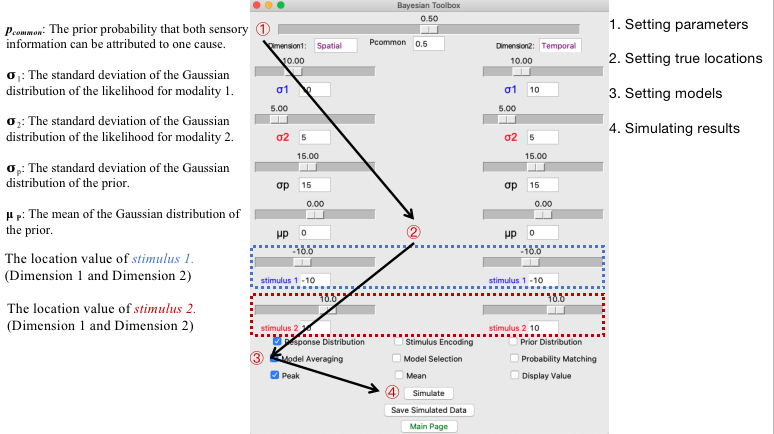

2D GUI Tutorial
===============

The 2D GUI fits and simulates Bayesian causal inference models in experiments
where each stimulus has two dimensions. A common example is an audiovisual
numerosity task in which each trial contains both numerosity information
(``Flash`` and ``Beep``) and temporal information (``SOA``).

Launch the 2D GUI
-----------------

.. code-block:: python

   import bcitoolbox as btb
   btb.gui2d()

Equivalent aliases are also available:

.. code-block:: python

   btb.gui_2d()
   btb.twoD()
   getattr(btb, "2D")()

Home Screen
-----------

The 2D GUI opens with three modules:

Model Fitting
   Fit one or more CSV datasets, compare decision strategies, visualize
   behavioral and model-predicted response distributions, and export figures
   or CSV summaries.

Simulation
   Simulate a single 2D continuous condition and preview the response
   distribution in real time.

About
   Citation, contact, and model background information.

Data Format
-----------

Each row should represent one behavioral trial. The default CSV format is:

.. csv-table::
   :header: "Flash", "Beep", "SOA", "R_F", "R_B"
   :widths: 15, 15, 15, 15, 15

   1, 1, 0, 1, 1
   1, 2, 150, 1, 2
   2, 1, 300, 2, 1
   2, 2, 500, 2, 2
   0, 1, , 0, 1
   1, 0, , 1, 0

``Flash`` and ``Beep``
   Primary-dimension stimuli for modality 1 and modality 2. In the default
   audiovisual numerosity case, these are visual flashes and auditory beeps.

``SOA``
   Secondary-dimension disparity. By default, the GUI interprets this as
   modality 1 minus modality 2.

``R_F`` and ``R_B``
   Participant responses for modality 1 and modality 2.

Missing unimodal values
   Use ``0`` for a missing modality stimulus. The GUI automatically treats the
   unavailable secondary value as missing during model evaluation.

You can create this template directly from the GUI by clicking
``Save suggested format``. A small example file is also available here:
:download:`demo_2d.csv <demo_2d.csv>`.

Column Mapping
--------------

The ``Data format`` panel allows the same model to be used across multiple
experimental designs.

Dimensions
   Choose ``Numerosity + Time``, ``Spatial + Time``, or
   ``Spatial + Numerosity``. The choice updates parameter labels and
   recommended default ranges.

Modality 1 and Modality 2
   Choose labels such as ``Visual`` and ``Auditory``. These labels appear in
   plots and exported files.

Secondary input
   Choose how the secondary dimension is represented:

   * ``Single disparity column: modality 1 minus modality 2``
   * ``Single disparity column: modality 2 minus modality 1``
   * ``Single disparity column: centered``
   * ``Two modality-specific columns``

Column selectors
   Map each model variable to the corresponding CSV column. After importing a
   file, the GUI reads the header row and fills the dropdown menus with the
   detected column names.

Fitting Settings
----------------

``Simulations``
   Number of Monte Carlo samples per condition. Use ``1000`` for a quick
   check and ``10000`` or higher for final analysis.

``Random seeds``
   Number of independent seed initializations. More seeds increase robustness
   and computation time.

``Fit type``
   ``mll`` computes a likelihood-based objective and enables log likelihood,
   AIC, and BIC output. ``minusr2`` and ``sse`` provide descriptive
   distribution-matching objectives.

``Tool``
   ``Powell`` is the default optimizer. ``VBMC`` can be selected when pyvbmc
   is available in the active environment.

``Strategies``
   Select one or more of ``ave``, ``sel``, and ``mat``. If multiple strategies
   are selected, the GUI fits each strategy and reports the best-fitting one
   for each dataset.

2D Parameters
-------------

.. list-table::
   :header-rows: 1
   :widths: 25 50 25

   * - Parameter
     - Meaning
     - Default role
   * - ``p_common``
     - Prior probability that the two modalities come from a common cause.
     - Free by default
   * - ``sigma_v_number`` / ``sigma_a_number``
     - Sensory uncertainty for the primary dimension in modality 1 and 2.
     - Free by default
   * - ``sigma_v_time`` / ``sigma_a_time``
     - Sensory uncertainty for the secondary dimension in modality 1 and 2.
     - Fixed by default
   * - ``sigma_number_prior`` / ``mu_number_prior``
     - Prior standard deviation and mean for the primary dimension.
     - Free by default
   * - ``sigma_time_prior`` / ``mu_time_prior``
     - Prior standard deviation and mean for the secondary dimension.
     - Fixed by default
   * - ``bias_v`` / ``bias_a``
     - Additive response bias for modality 1 and 2.
     - Fixed by default

The visible labels change with the selected dimensions and modalities. For
example, ``sigma_v_number`` may appear as ``sigma Visual numerosity``.

Run a Batch Fit
---------------

1. Open ``Model Fitting``.
2. Click ``Import CSV files`` and select one or more datasets.
3. Confirm the column mapping.
4. Choose dimensions, modalities, secondary-input mode, fit type, optimizer,
   and strategies.
5. Review free parameters and bounds.
6. Click ``Run batch fitting``.
7. Watch the output panel for seed-level optimization progress and final
   parameter estimates.

The GUI stores the best result for each imported dataset in memory until the
window is closed or a new batch is run.

Inspect and Export Results
--------------------------

``Visualize dataset``
   Opens a figure comparing behavioral response probabilities with model
   predictions for each condition.

``Save all figures``
   Saves one ``*_2d_bci_fit.png`` figure per dataset.

``Save prediction CSV``
   Exports condition-level behavioral and model-predicted response
   probabilities. This is the best file for custom plotting or reporting
   model checks.

``Save fitting summary CSV``
   Exports one row per dataset with error, log likelihood, AIC, BIC, number of
   free parameters, number of observations, selected strategy, optimizer,
   seed, dimensions, modalities, and fitted parameter values.

Simulation Tutorial
-------------------

Open ``Simulation`` from the home screen to preview the 2D model without
loading a dataset.

1. Select the dimension pair and modality labels.
2. Choose the decision strategy.
3. Enter the stimulus condition: modality 1 primary, modality 2 primary,
   modality 1 secondary, and modality 2 secondary.
4. Edit parameter values.
5. Click ``Run simulation`` or wait for the live preview to update.
6. Click ``Save simulated CSV`` to export simulated responses.

The simulation figure displays the stimulus locations, modality-specific
response clouds, density contours, and peak or mean response estimates. This
view is useful for checking whether a fitted parameter set produces plausible
2D behavior before running a large batch analysis.

Best Practices
--------------

* Verify the CSV mapping after import, especially when column names differ
  across experiments.
* Start with a small number of simulations while checking data formatting.
* Use multiple random seeds for final analyses.
* Keep parameter bounds scientifically plausible for the unit of measurement.
* Report the strategy set, fit objective, number of simulations, number of
  seeds, free parameters, and exported AIC/BIC values when applicable.
* Use ``mll`` when likelihood-based information criteria are needed.
